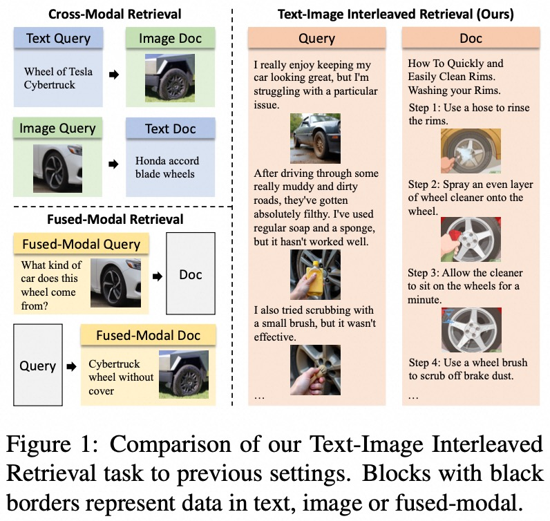
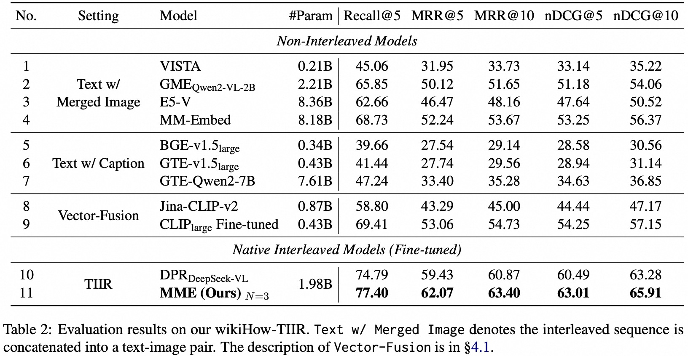

<div align="center">
<h1>Towards Text-Image Interleaved Retrieval</h1> 
</div>

<p align="center">
<a href="https://arxiv.org/abs/2502.12799">
  </a> 
<a href="https://opensource.org/license/mit">
  </a> 
<a href="https://github.com/vec-ai/wikiHow-TIIR/pulls">
    </a>
</p>


## Introduction
Current multimodal information retrieval studies mainly focus on single-image inputs, which limits real-world applications involving multiple images and text-image interleaved content.
In this work, we introduce the text-image interleaved retrieval (TIIR) task, where the query and document are interleaved text-image sequences, and the model is required to understand the semantics from the interleaved context for effective retrieval.

</a>

We construct a TIIR benchmark based on naturally interleaved wikiHow tutorials, where a specific pipeline is designed to generate interleaved queries.

| Part        | #Examples | Avg./Min/Max #Images | Avg. Text #Tokens | #Positives |
|-------------|-----------|----------------------|-------------------|-------------|
| Corpus      | 155,262   | 4.97 / 2 / 64        | 85.62             |             |
| Train Query | 73,084    | 2.88 / 2 / 4         | 105.15            | 1           |
| Test Query  | 7,654     | 2.81 / 2 / 4         | 105.59            | 1           |


To explore the task, we adapt several off-the-shelf retrievers and build a dense baseline by interleaved multimodal large language model (MLLM). We then propose a novel Matryoshka Multimodal Embedder (MME), which compresses the number of visual tokens at different granularity, to address the challenge of excessive visual tokens in MLLM-based TIIR models.

Experiments demonstrate that simple adaption of existing models does not consistently yield effective results. Our MME achieves significant improvements over the baseline by substantially fewer visual tokens.

</a>


## Dataset

The dataset has been open-sourced on [hf-link](https://huggingface.co/datasets/vec-ai/wikiHow-TIIR). Please download it and place it in the `data` folder.


## Evaluation

- Embedding Generate
  ```shell
  <!-- Two-stream Models -->
    python ./src/gen_embeddings_clip.py \
      --out_path $out_path \
      --model_name_or_path $model_name_or_path \
      --qrels_path data/qrels.jsonl \
      --doc_path data/docs.jsonl \
      --query_path data/queries.jsonl \
      --doc_image_root data/doc_images/ \
      --batch_size 16 \
      --it_type $it_type \
      --image_type $image_type \
      --model $model \
      --mixed_precision fp16 
  ```

  ```shell
  <!-- Single-image Multimodal Models -->
    accelerate launch --num_processes 1 ./src/gen_embeddings_multigpu.py \
      --out_path $out_path \
      --model_name_or_path $model_name_or_path \
      --qrels_path data/qrels.jsonl \
      --doc_path data/docs.jsonl \
      --query_path data/queries.jsonl \
      --doc_image_root data/doc_images/ \
      --batch_size 4 \
      --model $model \
      --mixed_precision bf16 
  ```

  ```shell
  <!-- Text Models -->
    python ./src/gen_embeddings_text.py \
      --out_path $out_path \
      --model_name_or_path $model_name_or_path \
      --qrels_path data/qrels.jsonl \
      --doc_path data/docs.jsonl \
      --query_path data/queries.jsonl \
      --doc_image_root data/doc_images/ \
      --batch_size 64 \
      --model $model \
      --maxtoken $maxtoken \
      --mixed_precision bf16 
  ```

- Retrieval
  ```shell
    python ./src/retrieval.py   \
      --query_embed_path  $out_path/query_embedding_${model}.pkl \
      --doc_embed_path $out_path/doc_embedding_${model}.pkl \
      --out_path $out_path \
      --model $model \
      --dim $dim
  ```
## Todo

- [ ] Release code for model training and evaluation.
- [x] Release code for evaluation.
- [x] Release code for data curation.
- [x] Release the `wikiHow-TIIR` dataset.

## Acknowledgments

Our retrieval corpus is built opon [wikiHow-VGSI](https://github.com/YueYANG1996/wikiHow-VGSI).
